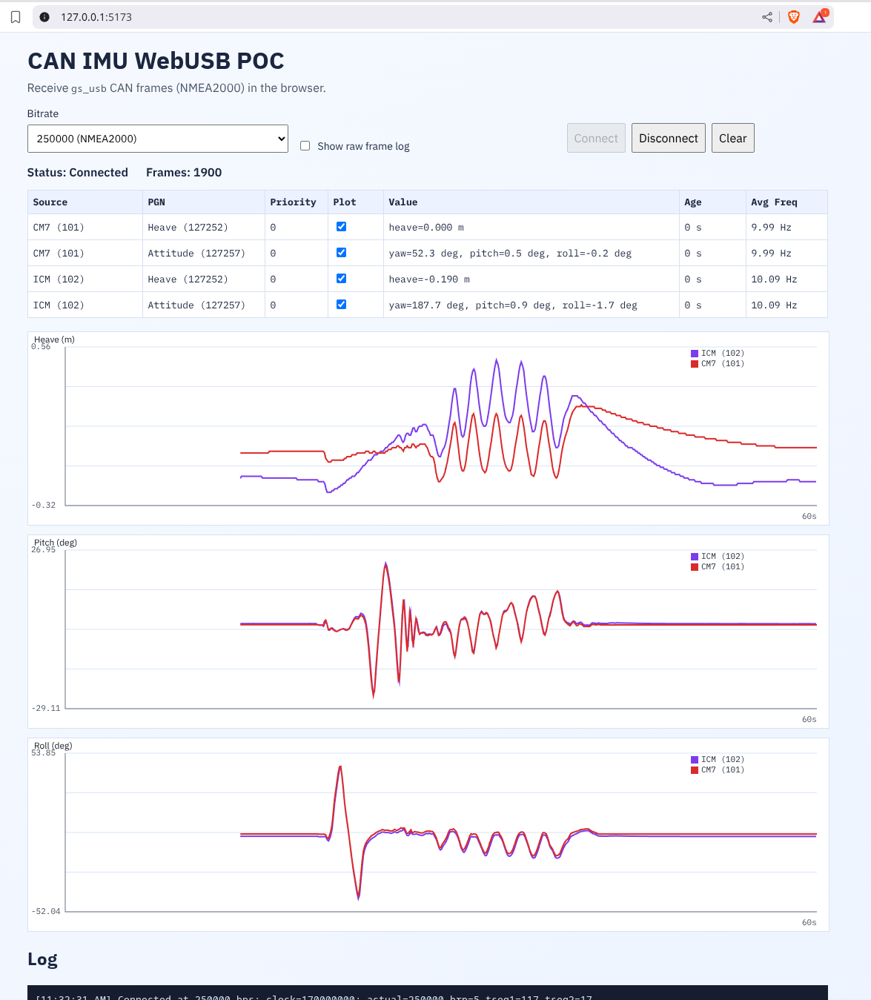

# CAN IMU WebUSB Proof of Concept

This is a minimal browser app that connects to a `gs_usb` CAN adapter over WebUSB and displays live
incoming NMEA2000 CAN frames for the CAN IMU. 

## Run

Start a local web server from this directory:

```bash
python3 -m http.server 5173
```

Open `http://localhost:5173`.

Click **Connect** and pick your CAN IMU device.

## Notes

- Use Chrome or Edge with WebUSB enabled.
- WebUSB requires a secure context (`https://`) or `localhost`.
- The app processes only PGNs `127257` and `127252`, but the raw log will display all CAN messages on the bus.

## Screenshot


